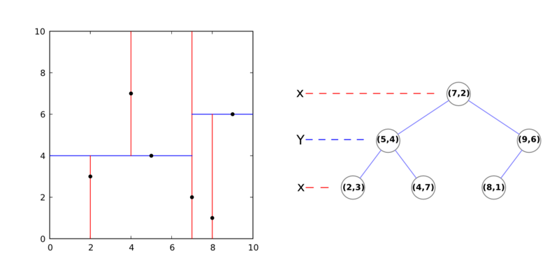
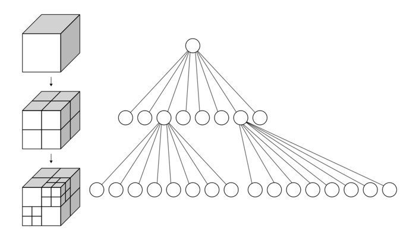
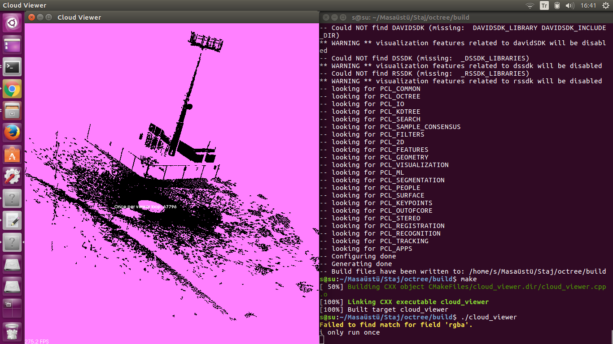

== K-D Tree
K-D tree k boyutlu bir uzayda bir diz noktayı tanımlayan bir veri yapısıdır. Dizi arama işlemlerini çok verimli hale getirir (Örneğin en yakın komşu uzaydaki bir noktaya en yakın noktayı bulmak veya bir daire içindeki tüm komşu noktaları bulmak için kullanılabilir)

Bu bir binary tree dir. Her düğümün sağ ve sol olmak üzere iki alt düğümü bulunmaktadır.Her seviye belirli bir boyut üzerindeki alanı böler. Örneğin 3 boyutlu uzayda kök düğümde (birinci seviye) tüm çocuklar ilk boyuta göre bölünürler, X'ten daha büyük X değerine sahip noktalar ağacın sağ düğümüne, daha küçük X değerine sahip noktalar sol düğüme gider. İkinci seviyede yeni oluşturulmuş olan düğümler aynı ölçütü kullanarak Y eksenini üzerinde yapılır. Üçüncü seviyede (düğümler) Z eksenini kullanırız. Dördüncü seviyede, X eksenine geri döneceğiz, vb. Genellikle, orta nokta her seviyede kök olarak seçilir. 

image::Kdtree.gif[]

=== Kod

Editörünüzde kdtree_search.cpp adında bir dosya oluşturun aşağıdakileri yerleştirin:
[source,c++]
----
#include <pcl/point_cloud.h>
#include <pcl/kdtree/kdtree_flann.h>

#include 
#include <vector>
#include <ctime>

int
main (int argc, char** argv)
{
  srand (time (NULL));

  pcl::PointCloud<pcl::PointXYZ>::Ptr cloud (new pcl::PointCloud<pcl::PointXYZ>);

  // Generate pointcloud data
  cloud->width = 1000;
  cloud->height = 1;
  cloud->points.resize (cloud->width * cloud->height);

  for (size_t i = 0; i < cloud->points.size (); ++i)
  {
    cloud->points[i].x = 1024.0f * rand () / (RAND_MAX + 1.0f);
    cloud->points[i].y = 1024.0f * rand () / (RAND_MAX + 1.0f);
    cloud->points[i].z = 1024.0f * rand () / (RAND_MAX + 1.0f);
  }

  pcl::KdTreeFLANN<pcl::PointXYZ> kdtree;

  kdtree.setInputCloud (cloud);

  pcl::PointXYZ searchPoint;

  searchPoint.x = 1024.0f * rand () / (RAND_MAX + 1.0f);
  searchPoint.y = 1024.0f * rand () / (RAND_MAX + 1.0f);
  searchPoint.z = 1024.0f * rand () / (RAND_MAX + 1.0f);

  // K nearest neighbor search

  int K = 10;

  std::vector pointIdxNKNSearch(K);
  std::vector<float> pointNKNSquaredDistance(K);

  std::cout << "K nearest neighbor search at (" << searchPoint.x 
            << " " << searchPoint.y 
            << " " << searchPoint.z
            << ") with K=" << K << std::endl;

  if ( kdtree.nearestKSearch (searchPoint, K, pointIdxNKNSearch, pointNKNSquaredDistance) > 0 )
  {
    for (size_t i = 0; i < pointIdxNKNSearch.size (); ++i)
      std::cout << "    "  <<   cloud->points[ pointIdxNKNSearch[i] ].x 
                << " " << cloud->points[ pointIdxNKNSearch[i] ].y 
                << " " << cloud->points[ pointIdxNKNSearch[i] ].z 
                << " (squared distance: " << pointNKNSquaredDistance[i] << ")" << std::endl;
  }

  // Neighbors within radius search

  std::vector pointIdxRadiusSearch;
  std::vector<float> pointRadiusSquaredDistance;

  float radius = 256.0f * rand () / (RAND_MAX + 1.0f);

  std::cout << "Neighbors within radius search at (" << searchPoint.x 
            << " " << searchPoint.y 
            << " " << searchPoint.z
            << ") with radius=" << radius << std::endl;

  if ( kdtree.radiusSearch (searchPoint, radius, pointIdxRadiusSearch, pointRadiusSquaredDistance) > 0 )
  {
    for (size_t i = 0; i < pointIdxRadiusSearch.size (); ++i)
      std::cout << "    "  <<   cloud->points[ pointIdxRadiusSearch[i] ].x 
                << " " << cloud->points[ pointIdxRadiusSearch[i] ].y 
                << " " << cloud->points[ pointIdxRadiusSearch[i] ].z 
                << " (squared distance: " << pointRadiusSquaredDistance[i] << ")" << std::endl;
  }

  return 0;
}

----

===== Kodun Açıklaması

Aşağıdaki kod random olarak noktalar oluşturur.
[source,c++]
----
 srand (time (NULL));

  pcl::PointCloud<pcl::PointXYZ>::Ptr cloud (new pcl::PointCloud<pcl::PointXYZ>);

  // Generate pointcloud data
  cloud->width = 1000;
  cloud->height = 1;
  cloud->points.resize (cloud->width * cloud->height);

  for (size_t i = 0; i < cloud->points.size (); ++i)
  {
    cloud->points[i].x = 1024.0f * rand () / (RAND_MAX + 1.0f);
    cloud->points[i].y = 1024.0f * rand () / (RAND_MAX + 1.0f);
    cloud->points[i].z = 1024.0f * rand () / (RAND_MAX + 1.0f);
  }
----

Bu sonraki kod parçası, kdtree nesnemizi oluşturur ve rastgele oluşturulmuş bulutumuzu girdi olarak ayarlar. Sonra rasgele koordinatları atanan bir "searchPoint" oluştururuz.
[source,c++]
----
pcl::KdTreeFLANN<pcl::PointXYZ> kdtree;

  kdtree.setInputCloud (cloud);

  pcl::PointXYZ searchPoint;

  searchPoint.x = 1024.0f * rand () / (RAND_MAX + 1.0f);
  searchPoint.y = 1024.0f * rand () / (RAND_MAX + 1.0f);
  searchPoint.z = 1024.0f * rand () / (RAND_MAX + 1.0f);
----

Şimdi bir tamsayı oluşturuyoruz (onu 10'a eşitleyelim) ve aramadan K komşularımızı saklamak için iki vektör oluşturuyoruz.
[source,c++]
----
  // K nearest neighbor search

  int K = 10;

  std::vector pointIdxNKNSearch(K);
  std::vector<float> pointNKNSquaredDistance(K);

  std::cout << "K nearest neighbor search at (" << searchPoint.x 
            << " " << searchPoint.y 
            << " " << searchPoint.z
            << ") with K=" << K << std::endl;
----

KdTree miz bizim daha önce oluşturmuş olduğumuz vektörde saklanmış olan  rastgele “Searchpoint”  10  en yakın yakın komşunun yerlerini yazdırır 0'dan fazla yakın komşuları döndürür.
[source,c++]
----
 if ( kdtree.nearestKSearch (searchPoint, K, pointIdxNKNSearch, pointNKNSquaredDistance) > 0 )
  {
    for (size_t i = 0; i < pointIdxNKNSearch.size (); ++i)
      std::cout << "    "  <<   cloud->points[ pointIdxNKNSearch[i] ].x 
                << " " << cloud->points[ pointIdxNKNSearch[i] ].y 
                << " " << cloud->points[ pointIdxNKNSearch[i] ].z 
                << " (squared distance: " << pointNKNSquaredDistance[i] << ")" << std::endl;
  }
----

Şimdi bazı (rastgele oluşturulmuş) yarıçap içinde verilen "searchPoint" e komşuları bulmamızı göstermektedir. Komşularımız hakkında bilgi depolamak için yine 2 vektör oluşturuyoruz.
[source,c++]
----
// Neighbors within radius search

  std::vector pointIdxRadiusSearch;
  std::vector<float> pointRadiusSquaredDistance;

  float radius = 256.0f * rand () / (RAND_MAX + 1.0f);
----

Daha önce olduğu gibi, KdTree'imiz belirtilen yarıçap içerisinde 0'dan fazla komşu bulursa, vektörlerimizde saklanan bu noktaların koordinatlarını yazdırır.
[source,c++]
----
 if ( kdtree.radiusSearch (searchPoint, radius, pointIdxRadiusSearch, pointRadiusSquaredDistance) > 0 )
  {
    for (size_t i = 0; i < pointIdxRadiusSearch.size (); ++i)
      std::cout << "    "  <<   cloud->points[ pointIdxRadiusSearch[i] ].x 
                << " " << cloud->points[ pointIdxRadiusSearch[i] ].y 
                << " " << cloud->points[ pointIdxRadiusSearch[i] ].z 
                << " (squared distance: " << pointRadiusSquaredDistance[i] << ")" << std::endl;
  }
----

===== Derleme Ve Çalıştırma
Aşağıdaki komutları CMakeLists.txt dosyamıza ekleyelim.
[source,c++]
----
cmake_minimum_required(VERSION 2.8 FATAL_ERROR)

project(kdtree_search)

find_package(PCL 1.2 REQUIRED)

include_directories(${PCL_INCLUDE_DIRS})
link_directories(${PCL_LIBRARY_DIRS})
add_definitions(${PCL_DEFINITIONS})

add_executable (kdtree_search kdtree_search.cpp)
target_link_libraries (kdtree_search ${PCL_LIBRARIES})
----

Şimdi yütütülebilir dosyamızı çalıştıralım
[source,c++]
----
$ ./kdtree_search

----
Sonuç olarak şöyle bi çıktı elde ederiz
[source,java]
----
K nearest neighbor search at (455.807 417.256 406.502) with K=10
  494.728 371.875 351.687 (squared distance: 6578.99)
  506.066 420.079 478.278 (squared distance: 7685.67)
  368.546 427.623 416.388 (squared distance: 7819.75)
  474.832 383.041 323.293 (squared distance: 8456.34)
  470.992 334.084 468.459 (squared distance: 10986.9)
  560.884 417.637 364.518 (squared distance: 12803.8)
  466.703 475.716 306.269 (squared distance: 13582.9)
  456.907 336.035 304.529 (squared distance: 16996.7)
  452.288 387.943 279.481 (squared distance: 17005.9)
  476.642 410.422 268.057 (squared distance: 19647.9)
Neighbors within radius search at (455.807 417.256 406.502) with radius=225.932
  494.728 371.875 351.687 (squared distance: 6578.99)
  506.066 420.079 478.278 (squared distance: 7685.67)
  368.546 427.623 416.388 (squared distance: 7819.75)
  474.832 383.041 323.293 (squared distance: 8456.34)
  470.992 334.084 468.459 (squared distance: 10986.9)
  560.884 417.637 364.518 (squared distance: 12803.8)
  466.703 475.716 306.269 (squared distance: 13582.9)
  456.907 336.035 304.529 (squared distance: 16996.7)
  452.288 387.943 279.481 (squared distance: 17005.9)
  476.642 410.422 268.057 (squared distance: 19647.9)
  499.429 541.532 351.35 (squared distance: 20389)
  574.418 452.961 334.7 (squared distance: 20498.9)
  336.785 391.057 488.71 (squared distance: 21611)
  319.765 406.187 350.955 (squared distance: 21715.6)
  528.89 289.583 378.979 (squared distance: 22399.1)
  504.509 459.609 541.732 (squared distance: 22452.8)
  539.854 349.333 300.395 (squared distance: 22936.3)
  548.51 458.035 292.812 (squared distance: 23182.1)
  546.284 426.67 535.989 (squared distance: 25041.6)
  577.058 390.276 508.597 (squared distance: 25853.1)
  543.16 458.727 276.859 (squared distance: 26157.5)
  613.997 387.397 443.207 (squared distance: 27262.7)
  608.235 467.363 327.264 (squared distance: 32023.6)
  506.842 591.736 391.923 (squared distance: 33260.3)
  529.842 475.715 241.532 (squared distance: 36113.7)
  485.822 322.623 244.347 (squared distance: 36150.5)
  362.036 318.014 269.201 (squared distance: 37493.6)
  493.806 600.083 462.742 (squared distance: 38032.3)
  392.315 368.085 585.37 (squared distance: 38442.9)
  303.826 428.659 533.642 (squared distance: 39392.8)
  616.492 424.551 289.524 (squared distance: 39556.8)
  320.563 333.216 278.242 (squared distance: 41804.5)
  646.599 502.256 424.46 (squared distance: 43948.8)
  556.202 325.013 568.252 (squared distance: 44751)
  291.27 497.352 515.938 (squared distance: 45463.9)
  286.483 322.401 495.377 (squared distance: 45567.2)
  367.288 550.421 550.551 (squared distance: 46318.6)
  595.122 582.77 394.894 (squared distance: 46938.1)
  256.784 499.401 379.931 (squared distance: 47064.1)
  430.782 230.854 293.829 (squared distance: 48067.2)
  261.051 486.593 329.854 (squared distance: 48612.7)
  602.061 327.892 545.269 (squared distance: 48632.4)
  347.074 610.994 395.622 (squared distance: 49475.6)
  482.876 284.894 583.888 (squared distance: 49718.6)
  356.962 247.285 514.959 (squared distance: 50423.7)
  282.065 509.488 516.216 (squared distance: 50730.4)
----

* Girişler: Noktalar, yarıçap | Komşu sayısı 
* Çıktılar: Nokta indisleri, Kare uzaklıkları

== OCTree
K-d tree gibi, oktree, aramalarda yararlı olan hiyerarşik bir ağaç veri yapısıdır, ancak aynı zamanda sıkıştırma veya aşağı örnekleme de vardır. Her oktree düğüm sekiz alt düğüme sahiptir ya da hiç sahip değildir. Kök düğüm tüm noktaları kapsülleyen bir kübik sınırlama kutusu tanımlar. Her seviyede, artan bir voksel çözünürlüğe neden olan 2 faktörü ile bölünür. Böylelikle, belirli bölgelere seçici bir şekilde daha fazla çözünürlük verebiliriz.

=== Kod
[source,c++]
----
#include <pcl/point_cloud.h>
#include <pcl/octree/octree_search.h>

#include 
#include <vector>
#include <ctime>

int
main (int argc, char** argv)
{
  srand ((unsigned int) time (NULL));

  pcl::PointCloud<pcl::PointXYZ>::Ptr cloud (new pcl::PointCloud<pcl::PointXYZ>);

  // Generate pointcloud data
  cloud->width = 1000;
  cloud->height = 1;
  cloud->points.resize (cloud->width * cloud->height);

  for (size_t i = 0; i < cloud->points.size (); ++i)
  {
    cloud->points[i].x = 1024.0f * rand () / (RAND_MAX + 1.0f);
    cloud->points[i].y = 1024.0f * rand () / (RAND_MAX + 1.0f);
    cloud->points[i].z = 1024.0f * rand () / (RAND_MAX + 1.0f);
  }

  float resolution = 128.0f;

  pcl::octree::OctreePointCloudSearch<pcl::PointXYZ> octree (resolution);

  octree.setInputCloud (cloud);
  octree.addPointsFromInputCloud ();

  pcl::PointXYZ searchPoint;

  searchPoint.x = 1024.0f * rand () / (RAND_MAX + 1.0f);
  searchPoint.y = 1024.0f * rand () / (RAND_MAX + 1.0f);
  searchPoint.z = 1024.0f * rand () / (RAND_MAX + 1.0f);

  // Neighbors within voxel search

  std::vector pointIdxVec;

  if (octree.voxelSearch (searchPoint, pointIdxVec))
  {
    std::cout << "Neighbors within voxel search at (" << searchPoint.x 
     << " " << searchPoint.y 
     << " " << searchPoint.z << ")" 
     << std::endl;

    for (size_t i = 0; i < pointIdxVec.size (); ++i)
   std::cout << "    " << cloud->points[pointIdxVec[i]].x 
       << " " << cloud->points[pointIdxVec[i]].y 
       << " " << cloud->points[pointIdxVec[i]].z << std::endl;
  }

  // K nearest neighbor search

  int K = 10;

  std::vector pointIdxNKNSearch;
  std::vector<float> pointNKNSquaredDistance;

  std::cout << "K nearest neighbor search at (" << searchPoint.x 
            << " " << searchPoint.y 
            << " " << searchPoint.z
            << ") with K=" << K << std::endl;

  if (octree.nearestKSearch (searchPoint, K, pointIdxNKNSearch, pointNKNSquaredDistance) > 0)
  {
    for (size_t i = 0; i < pointIdxNKNSearch.size (); ++i)
      std::cout << "    "  <<   cloud->points[ pointIdxNKNSearch[i] ].x 
                << " " << cloud->points[ pointIdxNKNSearch[i] ].y 
                << " " << cloud->points[ pointIdxNKNSearch[i] ].z 
                << " (squared distance: " << pointNKNSquaredDistance[i] << ")" << std::endl;
  }

  // Neighbors within radius search

  std::vector pointIdxRadiusSearch;
  std::vector<float> pointRadiusSquaredDistance;

  float radius = 256.0f * rand () / (RAND_MAX + 1.0f);

  std::cout << "Neighbors within radius search at (" << searchPoint.x 
      << " " << searchPoint.y 
      << " " << searchPoint.z
      << ") with radius=" << radius << std::endl;

  if (octree.radiusSearch (searchPoint, radius, pointIdxRadiusSearch, pointRadiusSquaredDistance) > 0)
  {
    for (size_t i = 0; i < pointIdxRadiusSearch.size (); ++i)
      std::cout << "    "  <<   cloud->points[ pointIdxRadiusSearch[i] ].x 
                << " " << cloud->points[ pointIdxRadiusSearch[i] ].y 
                << " " << cloud->points[ pointIdxRadiusSearch[i] ].z 
                << " (squared distance: " << pointRadiusSquaredDistance[i] << ")" << std::endl;
  }

}
----

==== Kod Açıklaması
Burada bir PointCloud Yapısı oluşturduk ve bunu random olarak oluşturulan noktalarla doldurduk.

[source,c++]
----
 pcl::PointCloud<pcl::PointXYZ>::Ptr cloud (new pcl::PointCloud<pcl::PointXYZ>);

  // Generate pointcloud data
  cloud->width = 1000;
  cloud->height = 1;
  cloud->points.resize (cloud->width * cloud->height);

  for (size_t i = 0; i < cloud->points.size (); ++i)
  {
    cloud->points[i].x = 1024.0f * rand () / (RAND_MAX + 1.0f);
    cloud->points[i].y = 1024.0f * rand () / (RAND_MAX + 1.0f);
    cloud->points[i].z = 1024.0f * rand () / (RAND_MAX + 1.0f);
  }
----
Ardından bir octree oluşturduk. Bu octree, yaprak düğümleri içinde bir nokta indisleri vektörü tutar. Çözünürlük parametresi, en küçük oktree seviyesindeki küçük voksellerin uzunluğunu tanımlar. Oktree'nin derinliği bu nedenle çözünürlük ve pointcloud'un uzaysal boyutunun bir fonksiyonudur. Pointcloud'un sınırlayıcı bir kutusu biliniyorsa, defineBoundingBox yöntemini kullanarak oktree'ye atanmalıdır. Sonra PointCloud'a bir işaretçi atadık ve tüm noktaları oktree'ye ekledik.

[source,c++]
----
 float resolution = 128.0f;

  pcl::octree::OctreePointCloudSearch<pcl::PointXYZ> octree (resolution);

  octree.setInputCloud (cloud);
  octree.addPointsFromInputCloud ();
----

PointCloud bir octree ile ilişkilendirildiğinde, arama işlemlerini gerçekleştirebiliriz. Burada kullanılan ilk arama yöntemi "Neighbors within Voxel Search" dır. Arama noktasını ilgili yaprak düğüm vokseline atar ve bir nokta indisleri vektörü döndürür. Bu endeksler, aynı voksel içinde yer alan noktalar ile ilgilidir. Arama noktası ile arama sonucu arasındaki mesafe, oktree'nin çözünürlük parametresine bağlıdır.

[source,java]
----
  std::vector pointIdxVec;

  if (octree.voxelSearch (searchPoint, pointIdxVec))
  {
    std::cout << "Neighbors within voxel search at (" << searchPoint.x 
     << " " << searchPoint.y 
     << " " << searchPoint.z << ")" 
     << std::endl;

    for (size_t i = 0; i < pointIdxVec.size (); ++i)
   std::cout << "    " << cloud->points[pointIdxVec[i]].x 
       << " " << cloud->points[pointIdxVec[i]].y 
       << " " << cloud->points[pointIdxVec[i]].z << std::endl;
  }
----

Daha sonra, bir K en yakın komşu arama işlemi yapılır. Bu örnekte, K, 10'a ayarlanmıştır. "K En Yakın Komşu Arama" yöntemi, arama sonuçlarını iki ayrı vektöre yazar. Birincisi pointIdxNKNSearch, arama sonucunu içerecektir (ilgili PointCloud veri setine atıfta bulunan indeksler). İkinci vektör, arama noktası ile en yakın komşular arasındaki karşılık gelen kareler uzaklıklarını tutar.

[source,java]
----
// K nearest neighbor search

  int K = 10;

  std::vector pointIdxNKNSearch;
  std::vector<float> pointNKNSquaredDistance;

  std::cout << "K nearest neighbor search at (" << searchPoint.x 
            << " " << searchPoint.y 
            << " " << searchPoint.z
            << ") with K=" << K << std::endl;

  if (octree.nearestKSearch (searchPoint, K, pointIdxNKNSearch, pointNKNSquaredDistance) > 0)
  {
    for (size_t i = 0; i < pointIdxNKNSearch.size (); ++i)
      std::cout << "    "  <<   cloud->points[ pointIdxNKNSearch[i] ].x 
                << " " << cloud->points[ pointIdxNKNSearch[i] ].y 
                << " " << cloud->points[ pointIdxNKNSearch[i] ].z 
                << " (squared distance: " << pointNKNSquaredDistance[i] << ")" << std::endl;
  }
----

"Radius Aramasında Komşular", "K En Yakın Komşu Arama" algoritmasına çok benzer çalışır. Arama sonuçları, nokta indekslerini ve kareler arama noktası mesafelerini tanımlayan iki ayrı vektöre yazılır.

[source,java]
----
std::vector pointIdxRadiusSearch;
  std::vector<float> pointRadiusSquaredDistance;

  float radius = 256.0f * rand () / (RAND_MAX + 1.0f);

  std::cout << "Neighbors within radius search at (" << searchPoint.x 
      << " " << searchPoint.y 
      << " " << searchPoint.z
      << ") with radius=" << radius << std::endl;

  if (octree.radiusSearch (searchPoint, radius, pointIdxRadiusSearch, pointRadiusSquaredDistance) > 0)
  {
    for (size_t i = 0; i < pointIdxRadiusSearch.size (); ++i)
      std::cout << "    "  <<   cloud->points[ pointIdxRadiusSearch[i] ].x 
                << " " << cloud->points[ pointIdxRadiusSearch[i] ].y 
                << " " << cloud->points[ pointIdxRadiusSearch[i] ].z 
                << " (squared distance: " << pointRadiusSquaredDistance[i] << ")" << std::endl;
----

==== Derleme ve Çalıştırma

CMakeLists.txt İçeriği:
[source,]
----
cmake_minimum_required(VERSION 2.8 FATAL_ERROR)

project(octree_search)

find_package(PCL 1.2 REQUIRED)

include_directories(${PCL_INCLUDE_DIRS})
link_directories(${PCL_LIBRARY_DIRS})
add_definitions(${PCL_DEFINITIONS})

add_executable (octree_search octree_search.cpp)
target_link_libraries (octree_search ${PCL_LIBRARIES})
----

Çalıştıralım

----
$ ./octreesearch
----

Şunun gibi bir çıktı alacağız:

[source,java]
----
Neighbors within voxel search at (974.82 188.793 138.779)
    903.656 82.8158 162.392
    1007.34 191.035 61.7727
    896.88 155.711 58.1942
K nearest neighbor search at (974.82 188.793 138.779) with K=10
    903.656 82.8158 162.392 (squared distance: 16853.1)
    903.18 247.058 54.3528 (squared distance: 15655)
    861.595 149.96 135.199 (squared distance: 14340.7)
    896.88 155.711 58.1942 (squared distance: 13663)
    995.889 116.224 219.077 (squared distance: 12157.9)
    885.852 238.41 160.966 (squared distance: 10869.5)
    900.807 220.317 77.1432 (squared distance: 10270.7)
    1002.46 117.236 184.594 (squared distance: 7983.59)
    1007.34 191.035 61.7727 (squared distance: 6992.54)
    930.13 223.335 174.763 (squared distance: 4485.15)
Neighbors within radius search at (974.82 188.793 138.779) with radius=109.783
    1007.34 191.035 61.7727 (squared distance: 6992.54)
    900.807 220.317 77.1432 (squared distance: 10270.7)
    885.852 238.41 160.966 (squared distance: 10869.5)
    1002.46 117.236 184.594 (squared distance: 7983.59)
    930.13 223.335 174.763 (squared distance: 4485.15)
----

== PCL Kütüphanesi Octree Kodunun Çalıştırılması

Daha önceden anlatıldığı gibi PCL kütüphanesi kurulduktan sonra bir octree kodunun çalıştırılması için aşağıdaki işlemler yapılmalıdır.

* Herhangibir klasörde bir diziinoluşturarak bu dizine gidiyoruz.
* Burada build adında bir klasörü aşağıdaki gibi oluşturuyoruz.

[source,]
----
mkdir build
----

* Daha sonra oluşturulan klasörün içine cloud_viewer.cpp CMakeLists.txt ve https://sourceforge.net/projects/pointclouds/files/PCD%20datasets/[Bu linkteki] örnek pcd uzantılı pcl dataseti indirilerek atıyoruz.

CMakeLists.txt’nin içeriği  

[source,java]
----
cmake_minimum_required(VERSION 2.8 FATAL_ERROR)

project(cloud_viewer)

find_package(PCL 1.2 REQUIRED)

include_directories(${PCL_INCLUDE_DIRS})
link_directories(${PCL_LIBRARY_DIRS})
add_definitions(${PCL_DEFINITIONS})

add_executable (cloud_viewer cloud_viewer.cpp)
target_link_libraries (cloud_viewer ${PCL_LIBRARIES})
----

cloud_viewer.cpp dosyasının içeriği  
[source,java]
----
#include <pcl/visualization/cloud_viewer.h>
#include 
#include <pcl/io/io.h>
#include <pcl/io/pcd_io.h>
/////////////////////
#include <pcl/point_cloud.h>
#include <pcl/point_types.h>
#include <pcl/io/openni_grabber.h>
#include <pcl/visualization/cloud_viewer.h>

#include <pcl/compression/octree_pointcloud_compression.h>
#include <stdio.h>
#include <sstream>
#include <stdlib.h>

#include <pcl/octree/octree.h>
#include <vector>
#include <ctime>

using namespace std;
int user_data;

void viewerOneOff (pcl::visualization::PCLVisualizer& viewer)
{
    viewer.setBackgroundColor (1.0, 0.5, 1.0);
    pcl::PointXYZ o;
    o.x = 1.0;
    o.y = 0;
    o.z = 0;
    viewer.addSphere (o, 0.25, "sphere", 0);
    std::cout << "i only run once" << std::endl;

}

void viewerPsycho (pcl::visualization::PCLVisualizer& viewer)
{
    static unsigned count = 0;
    std::stringstream ss;
    ss << "Once per viewer loop: " << count++;
    viewer.removeShape ("text", 0);
    viewer.addText (ss.str(), 200, 300, "text", 0);

    //FIXME: possible race condition here:
    user_data++;
}

int
main ()
{

    bool showStatistics = true;
    pcl::io::OctreePointCloudCompression<pcl::PointXYZRGBA>* PointCloudEncoder;
    pcl::io::OctreePointCloudCompression<pcl::PointXYZRGBA>* PointCloudDecoder;

    pcl::io::compression_Profiles_e compressionProfile = pcl::io::LOW_RES_OFFLINE_COMPRESSION_WITH_COLOR;

    // instantiate point cloud compression for encoding and decoding
    PointCloudEncoder = new pcl::io::OctreePointCloudCompression<pcl::PointXYZRGBA> (compressionProfile, showStatistics);
    PointCloudDecoder = new pcl::io::OctreePointCloudCompression<pcl::PointXYZRGBA> ();

    pcl::PointCloud<pcl::PointXYZRGBA>::Ptr cloud (new pcl::PointCloud<pcl::PointXYZRGBA>);
    pcl::io::loadPCDFile ("/home/yapbenzet/Documents/Untitled Folder/samp23-utm-ground.pcd", *cloud);

    pcl::visualization::CloudViewer viewer("Cloud Viewer");

      std::stringstream compressedData;

      pcl::PointCloud<pcl::PointXYZRGBA>::Ptr cloudOut (new pcl::PointCloud<pcl::PointXYZRGBA> ());

// datayı sıkıştırmak için kullanılıyor.
      PointCloudEncoder->encodePointCloud (cloud, compressedData);

      PointCloudDecoder->decodePointCloud (compressedData, cloudOut);

// Octree için aşağıdaki yorum satırlarını aktif edip yukarıdaki 2 satırı yorum satırı yapmalıyız.

 /*float resolution = 128.0f;

 	 pcl::octree::OctreePointCloudSearch<pcl::PointXYZRGBA> octree (resolution);

 	 octree.setInputCloud (cloud);
 	 octree.addPointsFromInputCloud ();*/

viewer.showCloud (cloud);

    viewer.runOnVisualizationThreadOnce (viewerOneOff);

    viewer.runOnVisualizationThread (viewerPsycho);
    while (!viewer.wasStopped ())
    {
    	user_data++;
    }
    return 0;
}
----

cmake ve make işlemlerini yapıyoruz.
[source,]
----
cmake ..
make
----
Son olarak oluşturulan görünüm dosyasını çalıştırıyoruz ve aşağıdaki gibi bir çıktı elde ediyoruz.
[source,]
----
./cloud_viewer
----

