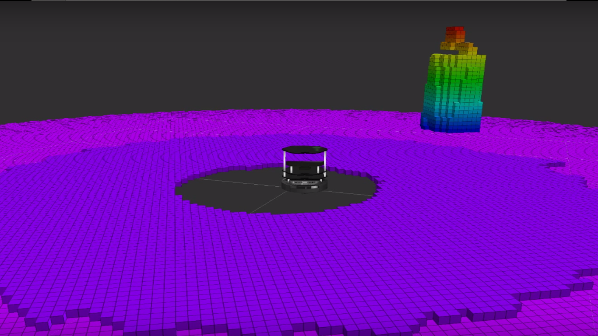
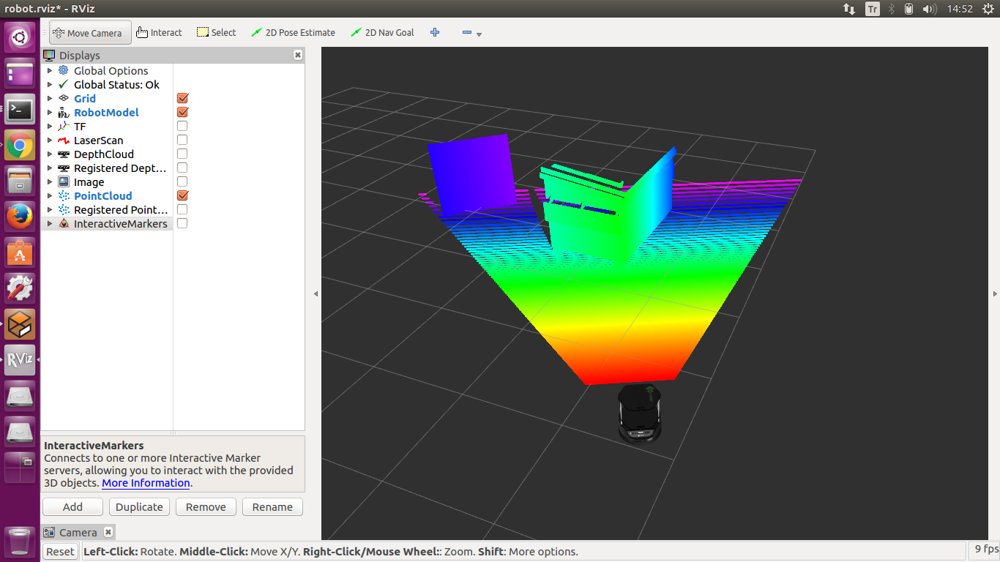
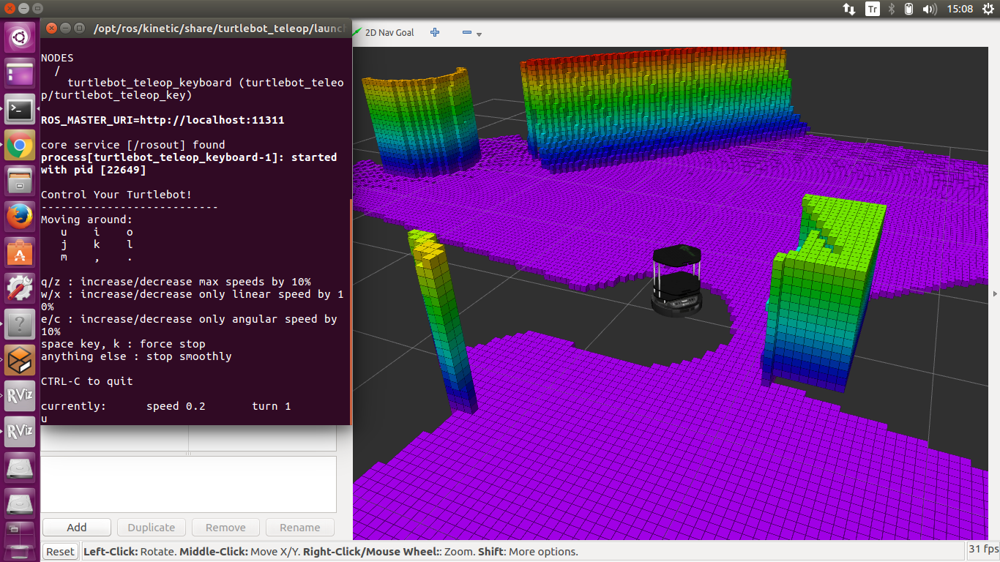

== Turtelbot 3d Haritalama

=== OctoMap
OctoMap kütüphanesirobotik için özellikle uygun C ++ veri yapıları ve eşleme algoritma sunan, bir 3D harita eşleme yaklaşımı uygular. Harita uygulaması bir oktree üzerine kuruludur.

OktoMap kullanarak gazebo üzerinden 3 boyutlu harita elde etmek bir tutorialdan faydalanarak aşağıdaki işlemleri yaptım.

gazebo ortamında similasyon için robotu çalıştırdım.
[source,]
----
sudo apt-get install ros-kinetic-octomap-server ros-kinetic-turtlebot ros-kinetic-turtlebot-teleop ros-kinetic-turtlebot-description ros-kinetic-turtlebot-navigation ros-kinetic-turtlebot-rviz-launchers ros-kinetic-turtlebot-simulator ros-kinetic-turtlebot-simulator
----

simülasyon paketini açalım
[source,]
----
roslaunch turtlebot_gazebo turtlebot_world.launch
----
rvizde görselleştirme için
[source,]
----
roslaunch turtlebot_rviz_launchers view_robot.launch
----

robot hareketi sağlamak için

[source,]
----
roslaunch turtlebot_teleop keyboard_teleop.launch
----

octomap_turtlebot.launch adında bir dosya oluşturup şunu yapıştıralım

[source,]
----
<launch>
<node pkg="octomap_server" type="octomap_server_node" name="octomap_server">
<param name="resolution" value="0.05" />

<param name="frame_id" type="string" value="odom" />

<!-- maximum range to integrate (speedup!) -->
<param name="sensor_model/max_range" value="5.0" />

<!-- data source to integrate (PointCloud2) -->
<remap from="cloud_in" to="/camera/depth/points" />

</node>
</launch>
----

http://ros-developer.com/2017/05/02/making-occupancy-grid-map-in-ros-from-gazebo-with-octomap/[Bu] siteyi takip ederek yaptığım tutorialda aşağıdaki görüntü oluşmaktadır.

Ancak ben çalıştırdığım zaman noktalar tarandıktan sonra görünmüyor.Aşağıdaki gibi bir görüntü oluşuyor.

Bu sorunu birçok yerde araştırmama rağmen bir çözüm bulamadım ve Rviz ile uğraşırken sorunu şöyle çözdüm.
Rviz içerisinden topiklere göre /occupied_cells_vis_array topiği ile marker_arrays ekleyerek halettim.

