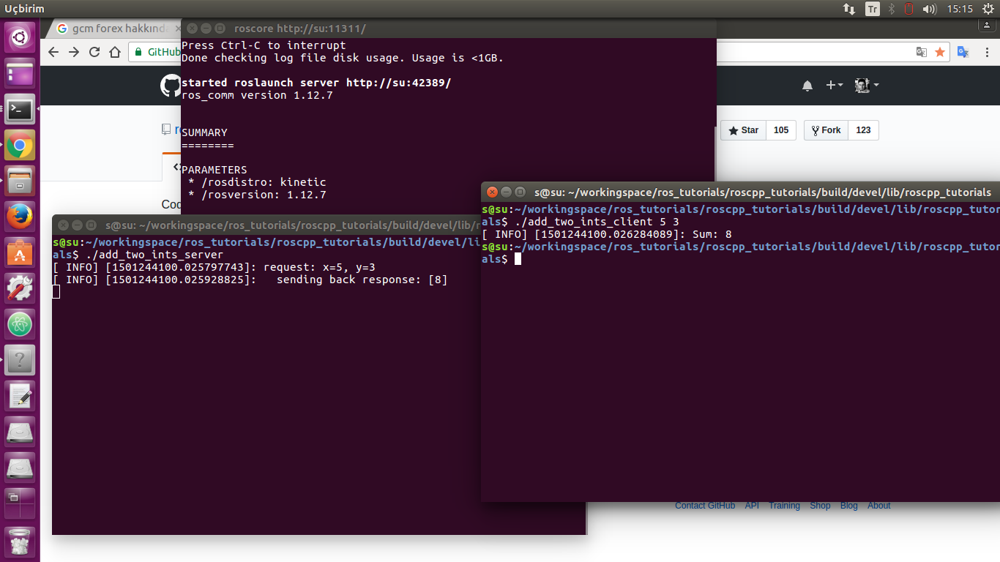

== Ros Kullanarak C++ İle İki Node Arasında İletişim Kurma
Ros Workspace içerisine giderek https://github.com/ros/ros_tutorials[Şuradaki] github deposunu indiriyoruz.
[source,]
----
cd /home/workingspace

git clone https://github.com/ros/ros_tutorials.git

----

Daha sonra  Bu depo içerisindeki roscpp_tutorials klasörüne geçelim.
[source,]
----
cd roscpp_tutorials
----

Burada build adında bir klasör oluşturalım ve içine girelim.
[source,]
----
mkdir build

cd build
----

ve make işlemini yapalım
[source,]
----
cmake ..

make
----

derleme işlemi gerçekleştikten sonra çıkan uygulamayı çalıştıralım.
[source,]
----
cd devel/lib/roscpp_tutorials

roscore

./add_two_ints_server

./add_two_ints_client 5 3

----

Sonuç olarak aşağıdaki gibi bir server ve client çalışacak client ile alınan argümanlar ros ile servera iletilecek ve toplamı yazdırılacaktır.

client

[source,]
----
#include "ros/ros.h"
#include "roscpp_tutorials/TwoInts.h"
#include <cstdlib>

int main(int argc, char **argv)
{
  ros::init(argc, argv, "add_two_ints_client");
  if (argc != 3)
  {
    ROS_INFO("usage: add_two_ints_client X Y");
    return 1;
  }

  ros::NodeHandle n;
  ros::ServiceClient client = n.serviceClient<roscpp_tutorials::TwoInts>("add_two_ints");
  roscpp_tutorials::TwoInts srv;
  srv.request.a = atoi(argv[1]);
  srv.request.b = atoi(argv[2]);
  if (client.call(srv))
  {
    ROS_INFO("Sum: %ld", (long int)srv.response.sum);
  }
  else
  {
    ROS_ERROR("Failed to call service add_two_ints");
    return 1;
  }

  return 0;
}

----

server

[source,]
----
#include "ros/ros.h"
#include "roscpp_tutorials/TwoInts.h"

bool add(roscpp_tutorials::TwoInts::Request  &req,
         roscpp_tutorials::TwoInts::Response &res )
{
  res.sum = req.a + req.b;
  ROS_INFO("request: x=%ld, y=%ld", (long int)req.a, (long int)req.b);
  ROS_INFO("  sending back response: [%ld]", (long int)res.sum);
  return true;
}

int main(int argc, char **argv)
{
  ros::init(argc, argv, "add_two_ints_server");
  ros::NodeHandle n;

// %Tag(SERVICE_SERVER)%
  ros::ServiceServer service = n.advertiseService("add_two_ints", add);
// %EndTag(SERVICE_SERVER)%

  ros::spin();

  return 0;
}
----

