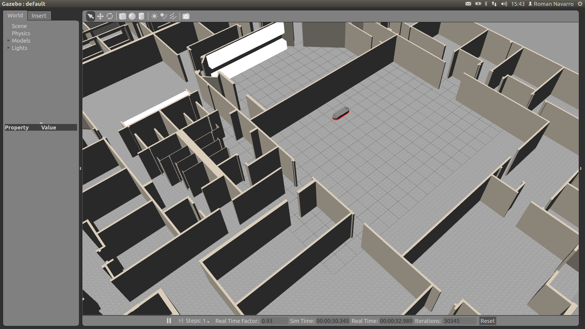
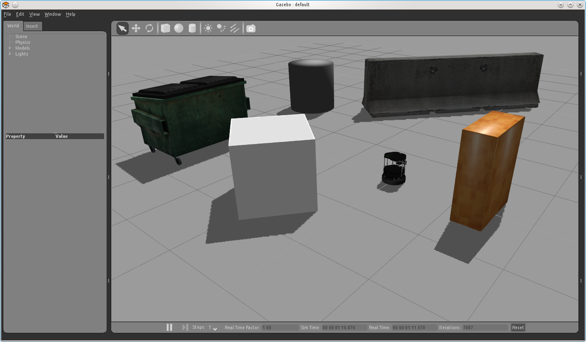
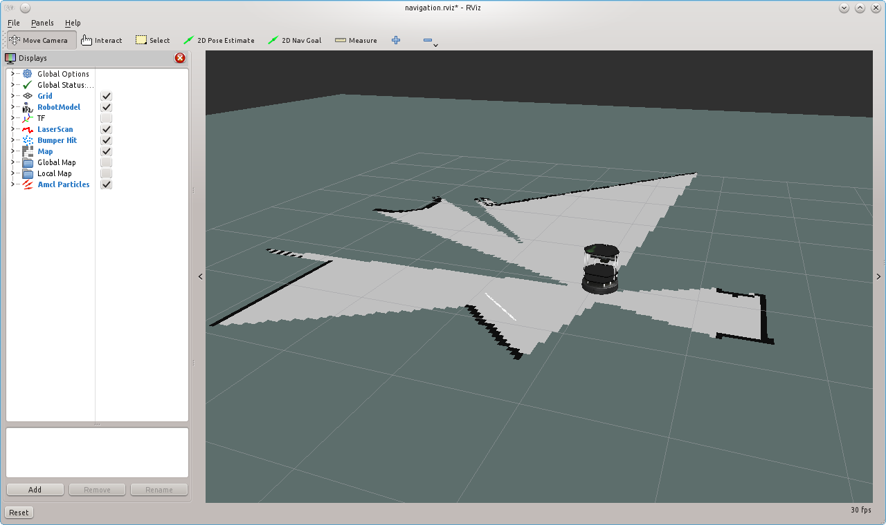

= Ros Gazebo Rviz Sanallaştırma

Ubuntu 16.04 üzerine http://yapbenzet.kocaeli.edu.tr/ros-kurulumu/[Bu] sayfasındaki adımları izleyerek ros kinetic kurmuştuk ancak roscore u çalıştırdığımızda ROS_PACKAGE_PATH ten kaynaklanan bir hata aldım. Bunun düzeltimi için araştırmalarım sonrasında .bashrc dosyasına kurulum sırasında girilen

[source,]
----
export ROS_PACKAGE_PATH=/home/user/ros/ros-pkg:/another/path
----
  
satırını aşağıdaki satırla değiştirmem sonrasında roscore çalıştı.
[source,]
----
export ROS_PACKAGE_PATH=~/workingspace:$ROS_PACKAGE_PATH

----

Ros ve gazebo ortamında yapılan çoğu tutorial turtlebot kullanılarak gerçekleştirilmektedir bunun üzerine ROS kinetic üzerine turlebot yükledik. Ancak turtlebot un resmi olarak şuan kinetic desteği bulunmamaktadır.Bunu üzerine turtlebot a alternatif yollar araştırılmış ve agvs-hydro-devel adında bir robotun paketini bulup indirerek mapping işlemini gerçekleştirmeye çalıştık. Ancak roslaunch komutu ile bunu rosta nasıl çalıştıracağımı bilmediğim için araştırma yaparak öğrendim. 

Hazır bir robot paketini ros gazebo ortamında çalıştırmak için ros kurulumunda tanımlanan çalışma dizinine paket atılır. Bu dizini aşağıdaki komut ile bulabilirsiniz.

[source,]
----
cd ~
gedit .bashrc
----

Paket dizine yerleştirildikten sonra örneğin bizim indirdiğimiz agvs robot paketi şu şekilde çalıştırılabilir.
[source,]
----
roslaunch agvs_gazebo agvs_office.launch
----
çalıştırma işleminden sonra aşağıdaki gibi gazebo görüntüsünü görebiliriz.

Gazebo ortamında sensörlerden gelen veriler ile oluşturulacak haritayı izleyebilmek için aşağıdaki gibi rviz kurulumunu gerçekleştirelim.

[source,]
----
sudo apt-get update
sudo apt-get install rviz
----

Ros üzerinden haritalama yapılması, gmapping çalıştırılması için gmapping kurulumu yapalım.
[source,]
----
sudo apt-get install ros-indigo-slam-gmapping
----

Daha sonra indirilen robot paketi için gmappingi çalıştıralım.

[source,]
----
roslaunch agvs_complete agvs_gmapping.launch
----

ancak bu robot için rviz launch dosyası bulunmadığı için görselleştirilemedi.

== Ros Kinetic Turtlebot Kurulumu

Ros kinetic turtlrbot'u resmi olarak desteklememektedir ancak bazı yerlerde resmi olmayan kurulumlar yapılmış. Bu kurulumu yapan kişilerde sık sık hatalarla karşılaşılaştıklarını yazmışlardır bende aşağıdaki kurulum adımlarını gerçekleştirerek ros kinetic üzerine turtlebot kurulumunu gerçekleştirdim ve devamında gelecek olan tutorialda bazı hatalarla karşılaçtım ancak bu hataları el ile giderdikten sonra turtlebot çalışmasında bir sıkıntı çıkmadı.

[source,]
----
sudo apt-get install ros-kinetic-turtlebot*
----
Şöyle bir hata ile karşılaşırsanız
[source,]
----
The following packages have unmet dependencies:
 ros-kinetic-turtlebot-bringup : Depends: ros-kinetic-realsense-camera but it is not going to be installed
----
Şu komutu deneyin.

----
sudo apt-get install ros-kinetic-realsense-camera
----
Bu komuttan sonra aşağudaki çıktı verilir ise
[source,java]
----
The following packages have unmet dependencies:
ros-kinetic-librealsense : Depends: linux-headers-generic but it is not going to be installed
----

bunu çalıştırın

----
sudo apt-get install linux-headers-generic
----

Ros kaynaklarını ekleyelim ve güncelleyelim

[source,]
----
sudo sh -c 'echo "deb-src http://us.archive.ubuntu.com/ubuntu/ xenial main restricted deb-src http://us.archive.ubuntu.com/ubuntu/ xenial-updates main restricted deb-src http://us.archive.ubuntu.com/ubuntu/ xenial-backports main restricted universe multiverse deb-src http://security.ubuntu.com/ubuntu xenial-security main restricted" > \ /etc/apt/sources.list.d/official-source-repositories.list'

sudo apt-get update
----

[source,]
----
sudo apt-get install build-essential g++
----

Tekrar deneyelim

[source,]
----
sudo apt-get install ros-kinetic-librealsense
----

Son olarak

[source,java]
----
sudo apt-get install ros-kinetic-realsense-camera
sudo apt-get install ros-kinetic-turtlebot
----
Ve turtlebot kurulumumuz tamamlanmıştır. Söylediğim gibi bu remi bir kurulum olmadığı için farklı hatalarla karşılaşabilirsiniz ancak bende şu ana kadar bir sıkıntı çıkmadı.

== Turtlebot Tutorial

Kurulum işleminden sonra bir tutorial ile devam edebiliriz. Öncelikle kaynaklarımızı yükleyelim.

[source,]
----
source /opt/ros/kinetic/setup.bash
----

Gazeboda simülasyon ortamımızı açalım.
[source,]
----

source /opt/ros/indigo/setup.bash

----

Harita oluşturma ilemize başlamak için gmapping çalıştıralım.
[source,]
----
roslaunch turtlebot_gazebo gmapping_demo.launch
----

Eğer bu komuttak sonra aşağıdaki gibi bir hata alırsanız.

[source,]
----
while processing /opt/ros/kinetic/share/turtlebot_navigation/launch/includes/gmapping.launch.xml:
Invalid roslaunch XML syntax: [Errno 2] No such file or directory: u'/opt/ros/kinetic/share/turtlebot_navigation/launch/includes/gmapping.launch.xml'
The traceback for the exception was written to the log file
----
Şu adımları izleyin
[source,]
----
sudo gedit /opt/ros/kinetic/share/turtlebot_gazebo/launch/gmapping_demo.launch

dosyadaki şu satırı:

<include file="$(find turtlebot_navigation)/launch/includes/gmapping.launch.xml"/>

bununla değiştiriyoruz:

<include file="$(find turtlebot_navigation)/launch/includes/gmapping/gmapping.launch.xml"/>

----

Harita oluşturulmasını görselleştirmek için rviz kullanabilirsiniz.
[source,]
----
$ roslaunch turtlebot_rviz_launchers view_navigation.launch
----

Son olarak haritamızı kaydedelim
[source,]
----
$ rosrun map_server map_saver -f <harita adı>
----

  

== Turtlebot3

http://spectrum.ieee.org/automaton/robotics/robotics-hardware/review-robotis-turtlebot-3[Bu kaynakta] Turtlebot3 ubuntu 16.04 ve ros kinetic in son sürümünü desteklediği yazmaktadır.

http://turtlebot3.readthedocs.io/en/latest/simulation.html#gazebo-3d[Bu kaynakta] ise turtlebot3 için gazebo ortamında sanallaştırmayla ilgili bir örnek mevcut.

http://turtlebot3.robotis.com/en/latest/index.html

